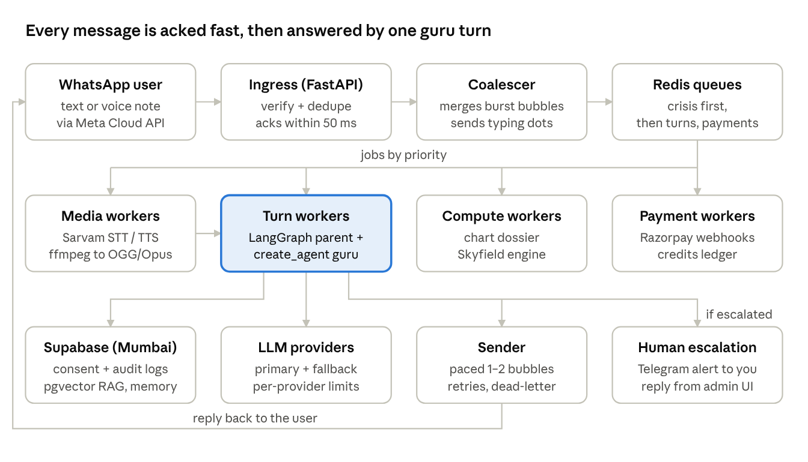
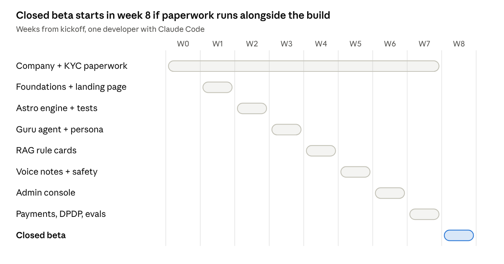

# AstroAI Guru — Product & Build Plan

Sep 27, 2026 · Akhil

We are building Guruji, a personal AI Vedic astrologer on WhatsApp for India, bootstrapped by one developer with Claude Code, aiming for a closed beta in about 8 weeks.

## Decisions so far

The product is chat-first on WhatsApp, onboarded in chat, paid for inside WhatsApp, and run lean on one DigitalOcean box plus Supabase.

| Area | Decision |
| --- | --- |
| Channel | WhatsApp only, via Meta Cloud API directly (no BSP) |
| Agent | LangChain `create_agent` inside a small LangGraph parent graph |
| Guruji persona | One pan-India neutral persona; mirrors the user's language; regional variants later |
| AI disclosure | Never claims to be human; disclosed once at onboarding; must still feel natural |
| Onboarding | Inside WhatsApp chat, driven by Click-to-WhatsApp ads (72h free window) |
| Phase 1 scope | Personalised chat + voice notes in and out |
| Voice | Sarvam STT/TTS for voice notes; LiveKit reserved for live calls (phase 3) |
| Database | Supabase (Postgres + pgvector + Auth), Mumbai region |
| Queue | Redis (burst merging, per-user locks, dedupe, rate limits) |
| RAG | Yes — factor-tagged rule cards with hybrid search in pgvector |
| Hosting | DigitalOcean Bangalore (BLR1) |
| Payments | Razorpay — native WhatsApp checkout for top-ups/passes, UPI Autopay for renewals |
| Admin | Custom Next.js console (Supabase Auth + MFA) |
| Escalation alerts | Telegram bot, no personal data in alerts |
| Company | Private Limited via MCA SPICe+, then K-SWIFT for state approvals |
| Landing page | Light single page + legal pages; main CTA opens WhatsApp |

## Product and Guruji

Guruji must feel like a real astrologer who remembers you, while never claiming to be human.

**Positioning.** Astrotalk, AstroSage and others sell per-minute human chats and in-app AI. Our edge: no app, a guru who remembers your chart and life, voice notes in your language, honest remedies with no fear-selling.

**Core principle.** Astrology maths is deterministic code; the LLM only interprets. A chart dossier (D1, D9, dasha, transits, yogas) is computed once at onboarding and stored as JSON.

**How Guruji feels human**

- A persona bible with 50–100 curated example exchanges in Hinglish, Hindi and English
- Asks back before reading ("timing, or whether to switch at all?")
- Visible memory: life-events facts table plus a readings ledger so he never contradicts himself
- Chart-specific readings that cite real placements
- WhatsApp-native: 1–2 short bubbles per turn, typing indicator, no markdown or lists, mirrors the user's language and script
- Scripted stances for testing, grief, anger, "you were wrong" and late-night anxiety
- A style checker blocks bot phrases ("As an AI…", "I hope this helps!")
- Blind "real astrologer?" transcript evals in CI

**Phase 1 includes**

- In-chat consent, 18+ gate and onboarding
- Chart engine and dossier
- Guru Q&A with memory, readings ledger and RAG
- Voice notes in and out (Hindi, English, Hinglish)
- Credits, passes and payments inside WhatsApp
- Guardrails, human escalation, data export/delete
- Admin console

**Later phases:** kundli matching, PDF reports, proactive transit alerts, regional personas and languages, live voice calls via LiveKit.

## Architecture

The webhook only acknowledges and queues; a turn worker runs the guru and a sender paces the reply back.

Every box is the same Docker image started with a different role flag, so scaling means running more containers of one role.

## Tech stack

Every layer either starts free or costs a few dollars, and each can grow without a rewrite.

| Layer | Choice | Why |
| --- | --- | --- |
| Channel | Meta WhatsApp Cloud API, direct | No BSP markup or lock-in |
| API + workers | FastAPI + Redis queue with `taskiq` or `arq` workers | Async; bursts absorbed; roles scale separately |
| Agent | LangGraph parent: consent gate → onboarding → `create_agent` guru | Consent and onboarding enforced in code; agent gets middleware |
| Agent middleware | Dynamic prompt, summarization, guardrails, PII redaction, style checker | Persona + dossier + memory injected per turn |
| LLM | Swappable via `init_chat_model`; cheap model for routing, strong for readings | Pick after a Hinglish bake-off; fallback provider |
| Astro engine | Skyfield (MIT) + JPL ephemeris; `pyswisseph` only as a test oracle | Swiss Ephemeris is AGPL; avoids source-disclosure risk |
| Geo + timezone | GeoNames offline + `timezonefinder` + `zoneinfo` | Free; correct historical timezones |
| Database | Supabase Postgres, Mumbai region | ACID ledger, pgvector, Auth, LangGraph checkpointer |
| RAG | Rule cards tagged by chart factor + hybrid (vector + full-text) search | Exact factor lookups first; semantic only for open questions |
| Embeddings | Multilingual model (API to start, self-hosted bge-m3 later) | Hindi/Hinglish queries must hit English cards |
| Voice notes | Sarvam STT (in) and TTS (out), ffmpeg to OGG/Opus | Replies show as real voice notes |
| Payments | Razorpay: WhatsApp native checkout + Subscriptions (UPI Autopay) | Only listed gateway that covers both needs |
| Hosting | DigitalOcean BLR1 droplet, docker compose | Always-on, low latency to Mumbai DB |
| Admin console | Next.js + shadcn, Supabase Auth with MFA | Inbox, users, business metrics, controls |
| Alerts | Telegram bot (IDs and links only) | Independent of the WhatsApp number |
| Landing page | Next.js static export on Cloudflare Pages | Free CDN; fast on 4G |
| Ops | Sentry, LangSmith (PII scrubbed), GitHub Actions, DO Container Registry | Free tiers cover beta |
| Later | LiveKit Agents for live "call Guruji" | Same agent service behind it |

## Deployment and scaling

Work is mostly waiting on the LLM, Sarvam and Meta, so parallelism comes from async concurrency and separate queues, not cores. The real limits are LLM rate limits, LLM cost and database connections.

**Queues by workload type**

- Turn workers: about 100 concurrent turns per process on asyncio
- Media and compute workers: CPU work in a process pool, capped at core count
- Priority: crisis > active turns > payments > voice > background

**Concurrency controls**

- Per-user lock: one turn at a time, replies stay in order
- Burst merging: messages sent within 2–4 s become one turn
- Global LLM and Sarvam rate limiters in Redis; overflow goes to a fallback model, then busy mode
- All DB access through Supabase's pooler (Supavisor, transaction mode) with small pools per process
- Chart dossier and rule-card lookups cached in Redis; fixed prompt order so provider caching hits
- Every job keyed by Meta message ID or turn ID, so retries never double-reply or double-charge

**Capacity check.** 10k daily users × 10 messages ≈ 100k turns a day, about 4 turns a second at the evening peak. One 4 vCPU droplet handles tens of thousands of daily users.

| Stage | Setup | Approx. cost |
| --- | --- | --- |
| Beta to about 5k DAU | 1 DO droplet (2–4 vCPU): Caddy, ingress ×2, turn ×2, media, compute, sender, scheduler, Redis (AOF) | $24–48/mo + Supabase |
| About 5k–50k DAU | DO Load Balancer, 2 ingress droplets, N worker droplets, DO Managed Valkey, Supabase Pro with bigger compute | About $100–250/mo |
| Viral / 50k+ | DOKS (managed Kubernetes) with KEDA autoscaling on queue depth; multiple LLM providers; Supabase read replica | Scales with usage |

**Viral-spike playbook, in order:** autoscale turn workers → route overflow to the fallback LLM → text instead of voice, cheaper model for small talk, pause background jobs → busy mode → admission control for new users → Telegram alert at each step.

**Deploys.** GitHub Actions builds one image, pushes to DO Container Registry, and does a rolling restart per role. Workers drain in-flight turns before shutdown. Targets: typing indicator within 1 s; first bubble in 3–8 s for text, 10–15 s for voice.

## Acquisition and landing page

Meta ads run as Click-to-WhatsApp (CTWA) ads and users onboard inside the chat, because a CTWA conversation opens a 72-hour window where every message is free.

**In-chat onboarding**

1. Guruji greets and says in one line he is an AI astrologer.
2. Consent via buttons ("I agree" / "Read privacy notice") plus an 18+ button; the button reply's message ID and timestamp are stored as proof.
3. Name, date, time and place collected one warm question at a time; messy answers handled; closest places offered as buttons.
4. Chart computed; first full reading delivered.
5. Optional later: a WhatsApp Flow form (native date/time pickers) as a fallback for messy answers.

**Using the 72-hour window**

- Hour 0: onboarding + first reading, the "wow" moment
- Within 72 h: one free check-in from Guruji (business-initiated messages are free in the window)
- Offer the ₹11 trial or Guru Plus before the window closes, at a natural pause

**Attribution.** CTWA messages carry a `referral` object (ad ID, source, click ID). We store it and send Lead and Purchase events via Meta's Conversions API, so the admin console shows ad → onboarded → paid.

**Caveat.** Only CTWA ads and Facebook Page buttons open the free window. Users from influencers, QR codes, Google or `wa.me` links onboard at the normal rate (about ₹1–1.5 each).

**Landing page (light, one page).** Needed for Meta Business verification, Razorpay KYC, trust and non-Meta traffic.

- Hero, how it works, sample chat screenshots, clear AI disclosure, pricing, FAQ
- One big "Chat with Guruji on WhatsApp" button; no web form
- Legal pages: privacy, terms, refund and cancellation, contact, grievance officer, delete-my-data request
- Next.js static on Cloudflare Pages; JS under 100 KB; English + Hindi
- Ad copy rules: no guaranteed outcomes; no lines that assume the viewer's situation (Meta personal-attributes policy)

## Business model

Freemium into dakshina credit packs and a Guru Plus pass, with round-figure prices ending in 1 (shagun style). All prices, limits and pack sizes live in config, editable from the admin console.

**Free**

- Welcome (first 72 h): onboarding, full first kundli reading, about 5 free questions, one free check-in
- After 72 h, "Daily Ashirwad": 1 short free answer a day, only when the user messages first

**Dakshina packs (one-time, in-chat checkout).** The unit is a prashna: one question plus up to 3 follow-ups on the same topic. Voice-reply prashnas cost 2 credits.

| Pack | Prashnas | ₹ per prashna | Note |
| --- | --- | --- | --- |
| ₹11 trial | 2 | 5.5 | Shown once, near the end of the 72 h window |
| ₹51 | 10 | 5.1 | |
| ₹101 | 25 | 4.0 | "Most chosen" |
| ₹251 | 70 | 3.6 | |
| ₹501 | 160 | 3.1 | |

**Guru Plus (prepaid pass by default, UPI Autopay optional)**

| Plan | Price | Effective per month |
| --- | --- | --- |
| Monthly | ₹199 | ₹199 |
| Quarterly | ₹501 | ₹167 |
| Yearly | ₹1,501 | ₹125 |

Includes up to 5 prashnas a day (fair use), voice replies, a monthly personal forecast, proactive dasha/transit/Sade Sati/muhurat alerts, priority in busy periods, and full memory.

**Premium one-time readings (phase 1.5):** muhurat ₹151, detailed kundli PDF ₹251, varshphal ₹301, kundli milan ₹501. Plus members get 30–50% off.

**Charging rules in chat**

- Offers only at natural pauses, never mid-reading; at most one offer a day
- Guruji states the cost before using a credit; "balance" always works
- Never charge in distress, crisis or escalated conversations
- A thumbs-down or a failed answer refunds the credit automatically
- GST invoice PDF sent in chat after each purchase

## Payments inside WhatsApp

Top-ups and passes are paid fully inside WhatsApp through Razorpay's native checkout; recurring mandates cannot be done inside WhatsApp today, so they go through the user's UPI app in about 3 taps.

**Why Razorpay.** WhatsApp's native India checkout (`order_details`) supports only BillDesk, Razorpay, PayU and Zaakpay — not Cashfree — and supports one-time orders only. Razorpay also has UPI Autopay subscriptions, so one gateway covers both needs.

**Top-up / pass flow (100% in chat)**

1. Guruji offers packs at a natural pause (list message).
2. We send an `order_details` "Review and Pay" card.
3. User pays with WhatsApp Pay or any UPI app, a card or netbanking, without leaving WhatsApp.
4. Webhook arrives; we confirm status with Razorpay's lookup API before crediting.
5. Ledger updated once (idempotent); Guruji confirms and resumes the conversation.

**Renewals — two options**

- **Default: prepaid passes** (1/3/12 months) bought through the same native checkout; Guruji reminds before expiry.
- **Optional: UPI Autopay.** User picks a plan in chat → "Set up Autopay" button → a tiny redirect on our domain opens GPay/PhonePe/Paytm with the mandate → PIN → back to WhatsApp → mandate-active webhook → Guruji confirms.
- RBI e-mandate rules apply: pre-debit notice before each charge; "cancel subscription" in chat revokes the mandate via API.
- Switch to Meta's native recurring payments if and when they ship.

**Before signing:** compare Razorpay vs PayU UPI pricing, and confirm Razorpay's mandate-intent link support during integration.

## Compliance, safety and human escalation

We build to the DPDP Act and Rules from day one, even though most obligations phase in over about 18 months from November 2025.

**Data protection (DPDP)**

- [ ] Plain-language notice (English, Hindi/regional) and explicit opt-in, stored with version, timestamp and message ID
- [ ] 18+ only (self-declaration at onboarding)
- [ ] Readings of the user's own chart only in phase 1; third-party charts later with their own consent language
- [ ] "STOP" and "delete my data" commands; deletion cascades to vectors, checkpoints and logs
- [ ] Grievance officer, privacy policy and retention policy published
- [ ] Breach runbook and audit logging (Board notice within 72 hours)
- [ ] Encryption at rest, per-field encryption for birth data, secrets in a vault, PII scrubbed from LLM traces
- [ ] Admin views of user data logged; birth details masked by default

**Platform and consumer rules**

- [ ] Meta: opt-in before any template, honour opt-outs, stay narrow (astrology only) under the 2026 AI-chatbot policy
- [ ] Guruji never claims to be human; disclosed once, answers honestly if sincerely asked
- [ ] No guaranteed outcomes, no cure claims for remedies, no fear-based upselling (consumer protection, ASCI)
- [ ] Credits are closed-system (no cash-out or transfer), with published expiry and refund policy
- [ ] Prices shown inclusive of GST; UPI Autopay follows RBI e-mandate rules

**Guardrails.** No predictions of death or lifespan, no medical diagnosis, no stock or trading calls, no legal verdicts. Everything framed as guidance.

**Human escalation**

- Triggers: self-harm or crisis signals, medical or legal emergencies, abuse, user asks for a human, repeated dissatisfaction, payment disputes, out-of-scope uncertainty
- Flow: warm holding message → state `escalated`, AI stops readings → Telegram alert (ID, category, severity, time, console link; no personal data) → you reply from the admin console, labelled as the human team → close or hand back
- Crisis: Guruji immediately and caringly shares Tele-MANAS 14416 and emergency 112, then escalates; unacknowledged crisis alerts re-ping after about 5 minutes
- Human replies after 24 h need an approved utility template, kept ready

## Costs and unit economics

A text reply costs us roughly ₹0.5–0.8 and a voice reply ₹1.3–2.0, so a typical prashna has a 60–80% gross margin; all figures are estimates to measure in beta.

**WhatsApp pricing change.** Several providers report that from 1 October 2026 Meta charges for service messages (our replies) after 1,000 free per number per month, at about ₹0.115 each plus GST in India. User messages and the 72-hour CTWA window stay free. Confirm on Meta's pricing page. Impact: 1–2 bubbles per turn, not 3.

| Cost per turn | Text reply | Voice reply |
| --- | --- | --- |
| WhatsApp messages | about ₹0.20 | about ₹0.14 |
| LLM (with caching) | about ₹0.30–0.60 | about ₹0.30–0.60 |
| Sarvam STT + TTS | — | about ₹0.80–1.20 |
| **Total** | **about ₹0.5–0.8** | **about ₹1.3–2.0** |

On revenue: 18% GST (prices are GST-inclusive) and about 2.4% Razorpay, so about ₹0.83 of every ₹1 is ours.

**Fixed costs pre-scale:** DO droplet about $24, Supabase free then $25, domain about ₹70/month. Total roughly ₹2–4.5k/month, plus CA and audit (about ₹15–30k/year) once the company exists.

**Metrics to validate in beta (assumptions, not forecasts)**

| Metric | Target to test |
| --- | --- |
| Cost per CTWA conversation | ₹10–30 |
| Onboarding completion | 60%+ |
| Free → paid within 30 days | 5–8% |
| ARPPU (paying users) | ₹150–250/month |
| Free-user serving cost | under ₹10/month |
| LTV : CAC | 3 or more by month 3 |

Free → paid conversion decides everything, so the welcome reading must be exceptional and the funnel must be visible per ad campaign from day one.

## Company and accounts setup

Incorporation is the slowest path and blocks Meta verification and Razorpay KYC, so it starts in week 0, in parallel with coding.

1. **Private Limited via MCA SPICe+** — one form gives incorporation, PAN, TAN, optional GST, and bank account opening via AGILE-PRO-S. Needs at least 2 directors and 2 shareholders; if solo, register a One Person Company and convert later. DSCs about ₹1–2k each.
2. **K-SWIFT self-declaration** — Kerala's single window for state-level approvals; it does not create the company.
3. **Udyam registration** (free), then **DPIIT Startup India** recognition; check KSUM programmes.
4. **Current account**, then **Meta Business verification** (needs company documents and the live website).
5. **Razorpay KYC**, then link Razorpay as the payment configuration in WhatsApp Manager.
6. **GST** — confirm threshold vs voluntary registration with a CA; pricing already assumes GST.
7. **Ongoing:** annual statutory audit and ROC filings (about ₹15–30k/year with a CA).

## Build timeline

Closed beta with 50–100 users lands in about week 8, provided incorporation and KYC start in week 0.

| Week | Work |
| --- | --- |
| 0 onward | SPICe+ incorporation → bank → Meta Business verification → Razorpay KYC |
| 1 | Repo, `CLAUDE.md`, CI; Supabase schema (consent, audit, users, charts, ledger, escalations); webhook + Redis worker + burst merging; landing page + legal pages |
| 2 | Astro engine with about 50 golden test charts checked against Swiss Ephemeris |
| 3 | Guru agent, persona bible, memory, readings ledger, in-chat onboarding |
| 4 | RAG: rule-card corpus + factor-tagged hybrid retrieval |
| 5 | Voice notes in and out; guardrails; escalation flow + Telegram alerts |
| 6 | Admin console: inbox, users, metrics, controls |
| 7 | Razorpay packs, passes and Autopay; DPDP export/delete; evals in CI; load test; Conversions API |
| 8 | Closed beta; daily persona tuning from real transcripts |

## Open questions

- [ ] Brand name and domain (needed for the landing page, Meta display name and Razorpay)
- [ ] Second director for the Pvt Ltd, or start as a One Person Company?
- [ ] Confirm the 1 October 2026 WhatsApp service-message pricing on Meta's own pricing page
- [ ] Confirm with a WhatsApp partner or Meta rep that an astrology-only AI service passes the 2026 AI-chatbot policy
- [ ] Primary LLM choice after the Hinglish bake-off
- [ ] Razorpay vs PayU UPI pricing; Razorpay mandate-intent link support
- [ ] GST registration timing (threshold vs voluntary) with a CA
- [ ] Final free-tier limits and pack prices after the first beta cohort

## Sources

- [Meta: WhatsApp Business Platform pricing](https://developers.facebook.com/documentation/business-messaging/whatsapp/pricing)
- [Meta: Receive payments via payment gateways on WhatsApp (India)](https://developers.facebook.com/documentation/business-messaging/whatsapp/payments/payments-in/pg/)
- [ChatMaxima: WhatsApp service message pricing from October 1, 2026](https://chatmaxima.com/blog/whatsapp-service-message-pricing-october-2026/)
- [respond.io: WhatsApp pricing change 2026](https://respond.io/blog/whatsapp-pricing-change-2026)
- [respond.io: WhatsApp's 2026 AI policy explained](https://respond.io/blog/whatsapp-general-purpose-chatbots-ban)
- [TechCrunch: WhatsApp bars general-purpose chatbots](https://techcrunch.com/2025/10/18/whatssapp-changes-its-terms-to-bar-general-purpose-chatbots-from-its-platform)
- [AiSensy: WhatsApp API pricing in India](https://aisensy.com/pricing)
- [Razorpay: WhatsApp payment gateway playbook 2026](https://razorpay.com/blog/whatsapp-support-for-payment-gateways-the-complete-2026-merchant-playbook)
- [RetailIntel: WhatsApp targets programmable UPI payments](https://retailintel.in/signal/whatsapp-targets-programmable-upi-payments-as-india-growth-l-5e1e3e41)
- [PIB: DPDP Rules, 2025 notified](https://static.pib.gov.in/WriteReadData/specificdocs/documents/2025/nov/doc20251117695301.pdf)
- [Taxmann: DPDP Act and Rules 2025 timeline](https://www.taxmann.com/post/blog/analysis-indias-dpdp-act-and-rules)
